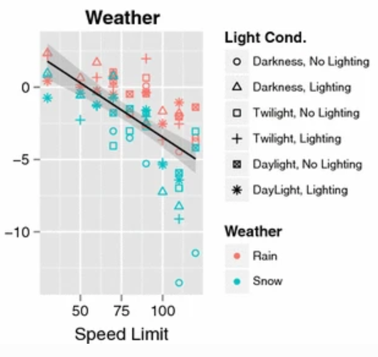

# Using embedded sensors to recognize weather patterns that can degrade autonomous vehicle performance

## Introduction and Problem Statement

Embedded sensors are becoming increasingly common. This ubiquity also increases their use in safety critical applications, such as autonomous vehicles or aerospace applications. If a sensor experiences a failure, or if the signal from the sensor degrades, it is necessary for the system to respond appropriately and adjust its behavior. Environmental impacts can often be the root cause of degradations or failures of embedded sensors. For instance, rain, wind, or snow can degrade the signal from a camera. Different classes of sensors have different strengths and weaknesses and thus will be susceptible to different types of failure modes and degradations.

This project will work to train an embedded system to respond to weather related degradations, such as rain, dust, and snow by using a Convolutional Neural Network (CNN). The system will output a qualitative description of the environment based on the training of the sensor which will indicate what environment the sensor is experiencing.

Depending on the environment that the system is in, the system may need to adjust operating behavior. For instance, if a camera in an autonomous vehicle identifies that the vehicle is operating in rain, the system may decrease its maximal operating speed and increase the following distance from other vehicles. This is a safety measure to mitigate the impact of a degradation on system safety.

## Prior Work

“The visual effects of rain are complex.” [1] All weather patterns are difficult to detect with computer vision since they are often residual elements of an image and rarely are the focus of the image. Despite this, rain or other weather patterns can have significant impacts on the ability of a computer vision algorithm to successfully identify objects in the image.

Autonomous vehicle developers refer to the Operational Design Domain (ODD) to refer to the specific environments where a vehicle is intended to operate. [2] The ODD can be limited by location, geography or topography, weather, time of day, or other parameters. Generally, a vehicle should not exit its ODD during operation and this is relatively easy to control if the ODD is governed by location. For instance, a GPS signal can be used to ensure that the vehicle remains within a given geo-fenced area. However, if the ODD is governed by weather then it may be outside of the control of the operators to determine when the ODD changes. For instance, if the vehicle is not intended to operate in rain then it may be necessary to halt service if it begins to rain.

It is reasonable to use human behavior as a baseline for how a semi-autonomous or autonomous vehicle should behave under a given set of conditions. It has been demonstrated that vehicle speeds will decrease when there is rain or snow, and vehicle speeds decrease more under adverse weather conditions when lighting is also poor. [4] While this may seem like common sense, it is also difficult to ensure that an autonomous vehicle will correctly adjust its behavior under these conditions.

The below chart from [4] indicates the effect that weather and lighting conditions have on vehicle speed. This general behavior is what a semi-autonomous or autonomous system should emulate.

Often, semi-autonomous or autonomous vehicle controls are governed by a finite state machine (FSM) which determines the operational parameters of the vehicle. For instance, some of the parameters controlled by this FSM may include maximum vehicle speed and minimum following distance to the forward vehicle. Without a reliable system to successfully identify different weather patterns, there is no way of correctly adjusting the state of the FSM to adjust vehicle parameters as weather patterns change.

There are existing systems that can determine the weather using computer vision. Tesla incorporates an “autowiper” feature which uses a fisheye camera and associated Neural Network (NN) to output a probability between 0 and 1 of whether there is moisture on the windshield. [3] However, this feature is susceptible to adversarial attacks either thru the physical world or algorithms that impact the output signal of the embedded camera itself.

## Project Schedule

Week 5 - Develop system functional block diagram and key components

Week 6 - Outline requirements for Neural Network (NN) to recognize weather patterns

Week 7 - Train NN to recognize different weather patterns

Week 8 - Continue to train NN for different weather patterns and begin to develop simulator for remainder of vehicle system

Week 9 - Ensure NN and system communicate properly to adjust system behavior depending on qualitative output from NN

Week 10 - Finalize presentation and documentation for project

## Technical Approach and Methods

The first step in this process will be to develop a dataset of video and images of a variety of weather conditions that may be experienced when driving. These include rain, snow, fog, and dust. Wherever possible, I would like to collect this data by temporarily mounting a camera on my car and driving in real-world conditions. However, it may not be possible to obtain images of all desired weather conditions in and around Los Angeles so the dataset will most likely need to be supplemented with additional images from online databases. All images will be scaled and sized appropriately to ensure compatibility with the desired camera.

As necessary, I will label the dataset for the supervised learning algorithm after it is collected. Some sources of data may come labeled depending on the database, and I will verify a subset of the labels to ensure they match with my labeling standard.

A Neural Network (NN) will be trained once the dataset is labeled. This will be a multi-label classification NN that will successfully identify the type of weather condition in each image or video. If time permits, I will be looking at multiple ways to train the NN to determine what is the best training method. The most straightforward, and the method I am already familiar with, will be training the NN on my personal computer. I will also look to train the NN on a NVIDIA Jetson Nano [6] where the 128 NVIDIA CUDA cores should offer increased performance. I am not as familiar with the Jetson Nano, so I may not be able to complete the whole project on that device.

I plan to use a NVIDIA Jetson Nano and an 8 Megapixel Raspberry Pi Camera Module V2 for final validation of this system. A custom environment will be created where the weather can be controlled. For simplicity, the environment will have a limited number of weather conditions including normal, rain, and fog. The Jetson Nano will be implementing the NN that has been previously trained and validated on the data sets discussed above. The video from the camera will be fed into the NN and processed in real time to output a variable which will be the weather in the chamber. Based on the characterized weather, the system will determine if it is necessary to adjust driving state for increased safety.

## Project Objectives

1. Create a labeled database of images and video showing a range of different weather conditions that a car may experience on the road.
2. Train a Neural Network (NN) to correctly identify and classify new images based on the weather conditions present.
3. Deploy the NN to an NVIDIA Jetson Nano with a Raspberry Pi Camera Module to emulate a camera on a car.
4. Create weather conditions in a custom environment and allow the system to respond.
5. Ensure that the system properly adjusts its internal Finite State Machine (FSM) depending on the weather conditions such that the vehicle always stays inside its Operational Design Domain (ODD) and that it operates within appropriate functional safety limits.

## Future Work

TBD

## References

[1] Garg, K. and Nayar, S.K. <i>Vision and Rain</i>. International Journal of Computer Vision, Dec. 2006.

[2] NHTSA. <i>Automated Driving Systems: a vision for safety</i>. US Dept. of Transportation, DOT HS 812 442, Sept. 2017.

[3] <i>Experimental Security Research of Tesla Autopilot</i>. Tencent Keen Security Lab, Mar. 2019.

[4] Jägerbrand, A.K. and Sjöbergh, J. <i>Effects of weather conditions, light conditions, and road lighting on vehicle speed.</i> Springerplus. 2016; 5: 505. Published online Apr. 2016.

[5] Zang, S. et al. <i> The Impact of Adverse Weather Conditions on Autonomous Vehicles: How Rain, Snow, Fog, and Hail Affect the Performance of a Self-Driving Car</i>. IEEE Vehicular Technology Magazine, Volume: 14 , Issue: 2, June 2019.

[6] NVIDIA Jetson Nano. https://www.nvidia.com/en-us/autonomous-machines/embedded-systems/jetson-nano/.

[7] Lindland, J. <i>The Seven Failure Modes: Failure Modes and Effects Analysis</i>. The Bella Group, 2007.

[8] ISO 26262 (all parts), <i>Road vehicles — Functional safety</i>. 2018.

## Contact Us

If you have any questions or want to reach out to discuss this project, you can reach [Glen Meyerowitz](https://glenmeyerowitz.com) on [Twitter](https://twitter.com/GlenMeyerowitz) or by [email](mailto:gmeyerowitz@ucla.edu).
