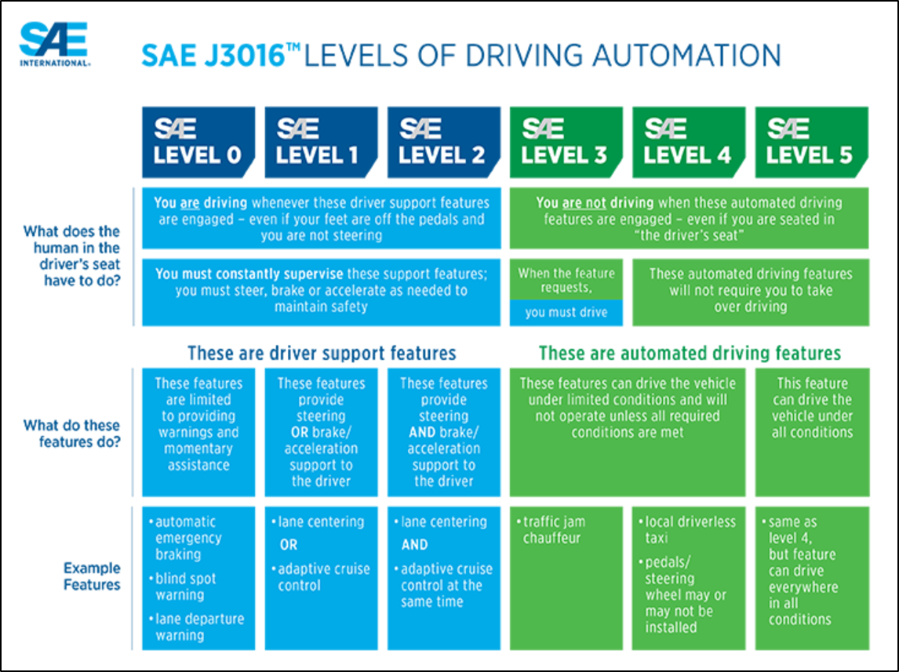
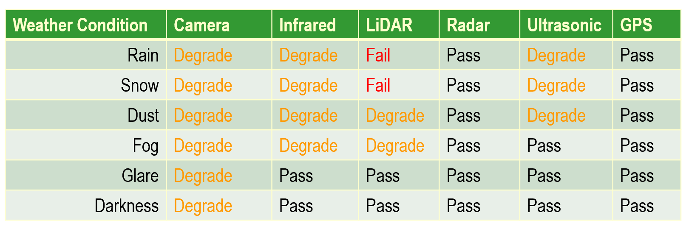
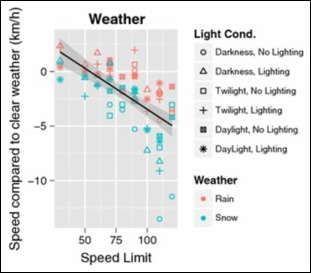
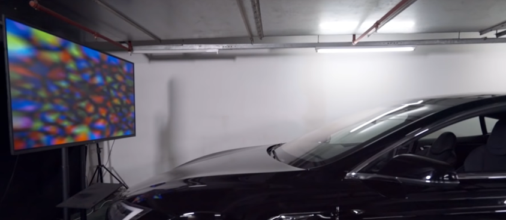

# Using embedded sensors to recognize weather patterns that can degrade autonomous vehicle performance

## Table of Contents

[Presentation](#presentation)  
[Introduction](#introduction-to-autonomous-vehicles-and-levels-of-automation)  
[Vehicle Automation](#vehicle-automation)  
[Prior Work](#prior-work)  
[Project Objectives](#project-objectives)  
[Technical Approaches](#technical-approach-and-methods)  
[Results](#results)  
[Implementation Weaknesses](#implementation-weaknesses)  
[Future Work](#future-work)  
[References](#references)  
[Contact Us](#contact-us)  
[Disclaimer](#disclaimer)  

## Presentation

The below link is a video presentation of this topic that was given on Monday, December 9, 2019.

The datasets that were used for training, validation, and test are located on a UCLA Google Drive, with the link below:
 
https://drive.google.com/open?id=1PXNgGudmmuYU-yl3vWjm_E5i0HcE6_CH

## Introduction to Autonomous Vehicles and Levels of Automation

In 2014, SAE (the Society of Automotive Engineers) released J3016 which introduced a new concept – levels of driving automation. These range from Level 0, complete human control, to Level 5, complete automation control. The six levels differentiate varying levels of control as automation systems become increasingly complex and able to deal with more advanced situations and perform safely. 

Level 0, 1, and 2 are essentially human operated vehicles with automation as a backup. Systems such as Automatic Emergency Braking (AEB) are an example of a use of automation technology to improve safety when a human driver fails to react properly. Levels 3, 4, and 5 are essentially the reverse. In these systems, the automated system is supposed to be in complete control and the human is the backup in case something fails. For Level 5, the human driver should be completely out of the loop when the vehicle is operating.

Throughout the scope of this work, we will be focusing on Level 4 autonomous systems. These are systems that are intended to operate inside a specific Operational Design Domain (ODD). An ODD is a limitation that is placed on the operation of an autonomous system. In short, the system can operate autonomously within a given ODD and it should be under human control when it is outside of that ODD. An ODD can be defined by the following factors:

1. Location (geo-fenced);
2. Geography;
3. Time of day;
4. Weather; and
5. Other factors that may impact the system.

Specific implementations of these depend on the design and development platform but they can include only operating in a physical location, such as a parking lot; only operating on flat terrain to avoid steep inclines; only operating in a given set of hours to avoid nighttime driving; only operating in sunny weather to avoid rain or snow; and more.

Based on the decisions made by autonomous vehicle manufacturers to choose an ODD for their vehicle, that leads us to understand that the true question for autonomous vehicles is not when they will be deployed, but where they will be deployed. This is often a question of unit economics, and how can a company develop a technology with a sufficiently simple ODD that the system can operate safety, but with a sufficiently large enough ODD that the high costs of developing an autonomous vehicle can be recovered.

## Vehicle Automation

Embedded sensors are becoming increasingly common. This ubiquity also increases their use in safety critical applications, such as autonomous vehicles or aerospace applications. If a sensor experiences a failure, or if the signal from the sensor degrades, it is necessary for the system to respond appropriately and adjust its behavior. Environmental impacts can often be the root cause of degradations or failures of embedded sensors. For instance, rain, wind, or snow can degrade the signal from a camera. Different classes of sensors have different strengths and weaknesses and thus will be susceptible to different types of failure modes and degradations. [5]

This project will work to train an embedded system to respond to weather related degradations, such as rain, fog, dust, and snow by using a Convolutional Neural Network (CNN). The system will output a qualitative description of the environment based on the training of the sensor which will indicate what environment the sensor is experiencing.

Depending on the environment that the system is in, the system may need to adjust operating behavior. For instance, if a camera in an autonomous vehicle identifies that the vehicle is operating in rain, the system may decrease its maximal operating speed and increase the following distance from other vehicles. This is a safety measure to mitigate the impact of a degradation on system safety.

It is important to note that different types of sensors will experience failures and degradations due to changing weather conditions in different ways. The below chart shows some of the ways, to the first order, that sensors may degrade or fail as ambient conditions change. While this chart is useful to give an understanding of the relationship between sensors and weather, it is not enough. The magnitude of a weather event is also very important as a light rain will have a very different effect on a camera than a thunderstorm.

## Prior Work

“The visual effects of rain are complex.” [1] All weather patterns are difficult to detect with computer vision since they are often residual elements of an image and rarely are the focus of the image. Despite this, rain or other weather patterns can have significant impacts on the ability of a computer vision algorithm to successfully identify objects in the image.

Autonomous vehicle developers refer to the Operational Design Domain (ODD) to refer to the specific environments where a vehicle is intended to operate. [2] The ODD can be limited by location, geography or topography, weather, time of day, or other parameters. Generally, a vehicle should not exit its ODD during operation and this is relatively easy to control if the ODD is governed by location. For instance, a GPS signal can be used to ensure that the vehicle remains within a given geo-fenced area. However, if the ODD is governed by weather then it may be outside of the control of the operators to determine when the ODD changes. For instance, if the vehicle is not intended to operate in rain then it may be necessary to halt service if it begins to rain.

It is reasonable to use human behavior as a baseline for how a semi-autonomous or autonomous vehicle should behave under a given set of conditions. It has been demonstrated that vehicle speeds will decrease when there is rain or snow, and vehicle speeds decrease more under adverse weather conditions when lighting is also poor. [4] While this may seem like common sense, it is also difficult to ensure that an autonomous vehicle will correctly adjust its behavior under these conditions.

The below chart from [4] indicates the effect that weather and lighting conditions have on vehicle speed. This general behavior is what a semi-autonomous or autonomous system should emulate.

Often, semi-autonomous or autonomous vehicle controls are governed by a finite state machine (FSM) which determines the operational parameters of the vehicle. For instance, some of the parameters controlled by this FSM may include maximum vehicle speed and minimum following distance to the forward vehicle. Without a reliable system to successfully identify different weather patterns, there is no way of correctly adjusting the state of the FSM to adjust vehicle parameters as weather patterns change.

There are existing systems that can determine the weather using computer vision. Tesla incorporates an “autowiper” feature which uses a fisheye camera and associated Neural Network (NN) to output a probability between 0 and 1 of whether there is moisture on the windshield. [3] However, this feature is susceptible to adversarial attacks either thru the physical world or algorithms that impact the output signal of the embedded camera itself.

## Project Objectives

1. Create a labeled database of images and video showing a range of different weather conditions that a car may experience on the road.
2. Train a Neural Network (NN) to correctly identify and classify new images based on the weather conditions present.
3. Deploy the NN to an NVIDIA Jetson Nano with a Raspberry Pi Camera Module to emulate a camera on a car.
4. Create weather conditions in a custom environment and allow the system to respond.
5. Ensure that the system properly adjusts its internal Finite State Machine (FSM) depending on the weather conditions such that the vehicle always stays inside its Operational Design Domain (ODD) and that it operates within appropriate functional safety limits.

## Technical Approach and Methods

Much of the code used for this project was adapted from a tutorial put together by Dr. Adrian Rosebrock [7]. In this tutorial, Dr. Rosebrock uses a trained CNN to identify natural disasters using a pretrained VGG16 network and adding additional training images for the specific area of interest. I was able to develop a custom dataset and use much of the same code to train a VGG16 network on a new dataset and then perform inferences and label video data. The efficient use of existing code repositories allowed me to best utilize my time on the novel portions of this project.

The first step in this process was to create a custom dataset of the training images for the VGG16 CNN. I was able to create a script that scraped these images from Google Images and bulk downloaded a set of images that are classified as “rain,” “snow,” “dusk,” and “nighttime.” All images should be of road conditions where the ambient conditions match the label. 

will be to develop a dataset of video and images of a variety of weather conditions that may be experienced when driving. These include rain, fog, dust, and snow. Wherever possible, I would like to collect this data by temporarily mounting a camera on my car and driving in real-world conditions. However, it may not be possible to obtain images of all desired weather conditions in and around Los Angeles so the dataset will most likely need to be supplemented with additional images from online databases. All images will be scaled and sized appropriately to ensure compatibility with the desired camera.

As necessary, I will label the dataset for the supervised learning algorithm after it is collected. Some sources of data may come labeled depending on the database, and I will verify a subset of the labels to ensure they match with my labeling standard.

A Convolutional Neural Network (CNN) will be trained once the dataset is labeled. This will be a multi-label classification CNN that will successfully identify the type of weather condition in each image or video. If time permits, I will be looking at multiple ways to train the NN to determine what is the best training method. The most straightforward, and the method I am already familiar with, will be training the NN on my personal computer. I will also look to train the CNN on a NVIDIA Jetson Nano [6] where the 128 NVIDIA CUDA cores should offer increased performance. I am not as familiar with the Jetson Nano, so I may not be able to complete the whole project on that device.

I plan to use a NVIDIA Jetson Nano and an 8 Megapixel Raspberry Pi Camera Module V2 for final validation of this system. A custom environment will be created where the weather can be controlled. For simplicity, the environment will have a limited number of weather conditions: rain and fog. The Jetson Nano will be implementing the CNN that has been previously trained and validated on the data sets discussed above. The video from the camera will be fed into the CNN and processed in real time to output a variable which will be the weather in the chamber. Based on the characterized weather, the system will determine if it is necessary to adjust driving state for increased safety.

## Results

The initial results for this project are very positive. The below video shows the labels produced for a ten second clip of real-world data that was taken on I-405 near UCLA campus.

There are a few interesting elements to note about this video. First is that in the first few frames, the images are incorrectly classified as “snow.” As was discussed in the technical approach above, we used a smoothing approach that averages the labels over 128 previous frames. Thus, the initial frames have a higher likelihood of an incorrect label due to the lack of previous labels for an average. This problem resolves itself after a number of frames. 

It is also interesting that when the windshield wipers go across the screen, the classifier determines that the frame is at “night.” While this is also an incorrect label, it is easy to understand how the classifier made this mistake due to the fact that all of the nighttime images on which the classifier was trained were dark. When the windshield wipers go across the camera field of view, it temporarily becomes dark which is similar to the nighttime training data.
	

The last few seconds of this clip show the correct label on all the frames. This indicates that the average is working and the classification system has correctly determined that this short clip was taken while it was “raining” outside.

The classification can be fed back into a state function representing an autonomous vehicle and control parameters such as maximum speed, following distance, and minimum turning radius at a given speed. This Finite State Machine (FSM) was not developed for this project due to time limitations.

## Implementation Weaknesses

As far as is known, the only existing implementation of a neural network to detect weather is found in Tesla ‘autowipers.’ Tesla uses the front facing camera to detect if it is raining, and if a neural network indicates that it is raining the system will turn on windshield wipers. Standard rain sensors use the principal of total internal reflection to detect moisture by shining an infrared light on the windshield and detecting whether it is reflected or not due to moisture. The Tesla implementation, however, uses a camera for the purpose of detecting rain. It is important to note that that the Tesla autowiper feature only can detect rain, and not other weather patterns, and it is not expected that the autowiper output feeds into vehicle controls for safety and planning.

In early 2019, researchers at Tencent Keen Security Lab demonstrated that the autowiper feature is susceptible to malicious attacks. Similar to other neural networks, the neural network at the heart of the autowiper feature is a black box. There is no definitive way to understand how the system outputs a given value and the decision making cannot be audited well.

The Tencent team was able to create a seemingly garbage image that does not represent anything to the human eye. However, when this image is placed on a screen in front of a Tesla with the autowiper feature enabled, the system will respond and turn on the windshield wipers.

The ability of malicious actors to essentially hack the neural network represents a threat and weakness to any system that is developed with neural networks at the core, such as what was presented in this work. While the results are reliable and useful when the system is within nominal operational bounds, for safety critical systems that operate in autonomous vehicles that may not be sufficient to meet all safety requirements.

## Future Work

This work focused on the study of weather detection using single, forward facing camera. One exciting area for future work is to incorporate sensor fusion to increase the reliability of the methods presented here. We acknowledge there are inherent weaknesses in detecting weather patterns that can degrade a sensor with that same type of sensor. The addition of a radar or lidar unit would improve the ability of the system proposed here to more robustly detect weather patterns.

In addition, I would be interested in expanding the work to include deployment on an embedded system on a vehicle. Due to time limitations of this project, and my personal lack of familiarity with the NVIDIA Jetson Nano developer board, I was not able to successfully deploy the trained network to identify weather patterns on-board. With some additional time, this is a challenge that should be easy to overcome, and a full system can be implemented and presented.

## References

[1] Garg, K. and Nayar, S.K. <i>Vision and Rain</i>. International Journal of Computer Vision, Dec. 2006.

[2] NHTSA. <i>Automated Driving Systems: a vision for safety</i>. US Dept. of Transportation, DOT HS 812 442, Sept. 2017.

[3] <i>Experimental Security Research of Tesla Autopilot</i>. Tencent Keen Security Lab, Mar. 2019.

[4] Jägerbrand, A.K. and Sjöbergh, J. <i>Effects of weather conditions, light conditions, and road lighting on vehicle speed.</i> Springerplus. 2016; 5: 505. Published online Apr. 2016.

[5] Zang, S. et al. <i>The Impact of Adverse Weather Conditions on Autonomous Vehicles: How Rain, Snow, Fog, and Hail Affect the Performance of a Self-Driving Car</i>. IEEE Vehicular Technology Magazine, Volume: 14 , Issue: 2, June 2019.

[6] “SAE International Releases Updated Visual Chart for Its “Levels of Driving Automation” Standard for
Self Driving Vehicles.” Accessed on 12/6/2019.

[7] Rosebrock, Adrian. <i> Detecting Natural Disasters with Keras and Deep Learning. </i> https://www.pyimagesearch.com/2019/11/11/detecting-natural-disasters-with-keras-and-deep-learning/. Accessed on November 20, 2019.

[8] NVIDIA Jetson Nano. https://www.nvidia.com/en-us/autonomous-machines/embedded-systems/jetson-nano/.

[9] Lindland, J. <i>The Seven Failure Modes: Failure Modes and Effects Analysis</i>. The Bella Group, 2007.

[10] ISO 26262 (all parts), <i>Road vehicles — Functional safety</i>. 2018.

## Contact Us

If you have any questions or want to reach out to discuss this project, you can reach [Glen Meyerowitz](https://glenmeyerowitz.com) on [Twitter](https://twitter.com/GlenMeyerowitz) or by [email](mailto:gmeyerowitz@ucla.edu).

## Disclaimer

This report reflects only the present considerations and views of the author and do not necessarily reflect those of any firms or organizations with which the author is or has been affiliated.

